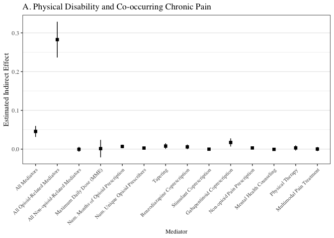
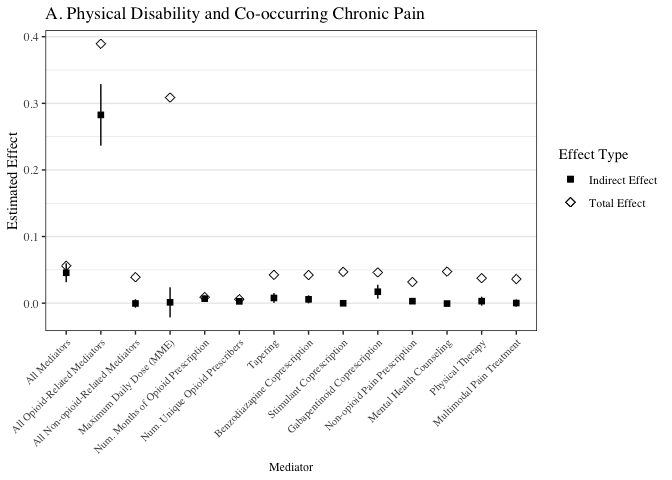
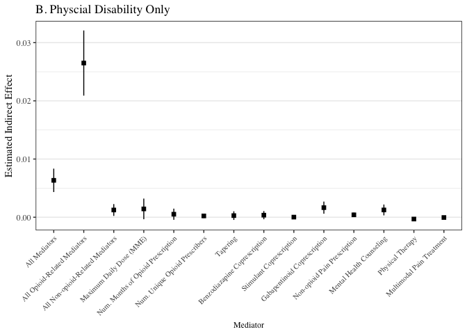
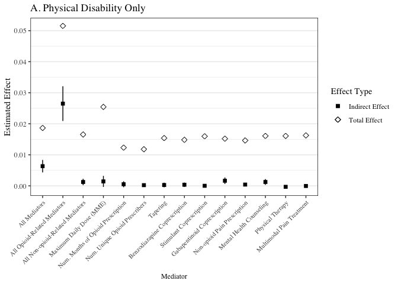
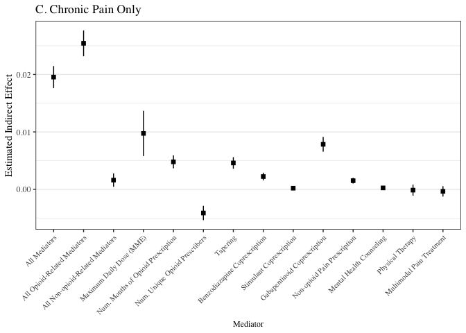
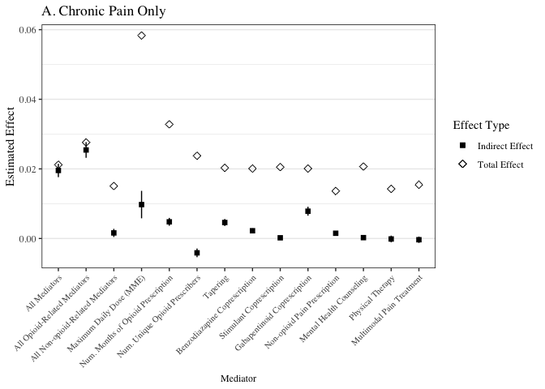
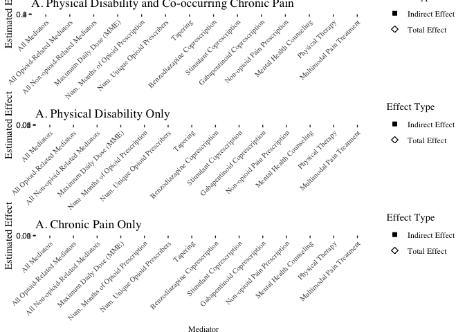

Indirect Effect Result Forest Plots
================
2023-10-26

# Disability and Chronic Pain

Indirect effect only:

<!-- -->

Indirect effect and total effect:

<!-- -->

# Disability Only

Indirect effect only:

<!-- -->

Indirect effect and total effect:

<!-- -->

# Chronic Pain Only

Indirect effect only:

<!-- -->

Indirect effect and total effect:

<!-- -->

<!-- -->

    ## TableGrob (3 x 1) "arrange": 3 grobs
    ##   z     cells    name           grob
    ## 1 1 (1-1,1-1) arrange gtable[layout]
    ## 2 2 (2-2,1-1) arrange gtable[layout]
    ## 3 3 (3-3,1-1) arrange gtable[layout]
